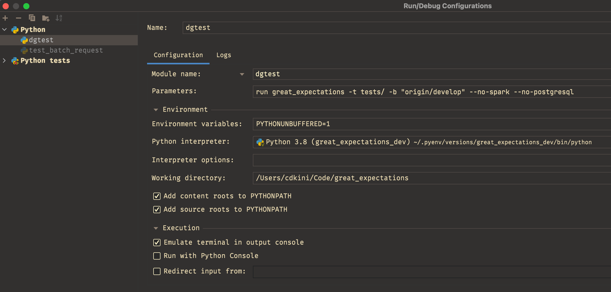

<h2 align="center">dgtest</h2>

<p align="center">
<a href="https://asciinema.org/a/kUYvSCoqbtrddwgYigoPKOSHc?autoplay=1">
    
</a>
</p>

---

`dgtest` aims to improve the performance of your test runs by only selecting relevant tests based on your Git state.
Using AST parsing, `dgtest` creates dependency graphs out of your codebase and uses traditional graph traversal algorithms to select the smallest possible
subset of the test suite required to obtain coverage over a given commit or PR. Please read [How It Works](#How-It-Works) for more details.

As a disclaimer, this tool is designed to be used in tandem with your current testing strategy. `dgtest` provides a high level of accuracy but ultimately is a static
analysis tool and relies on adherence to Pythonic conventions (namely imports as discussed in the [Google Python Style Guide](https://google.github.io/styleguide/pyguide.html#224-decision0)).
If you use this tool, ensure you still run the full suite every so often.

Note that `dgtest` only works with codebases that use `pytest` as a testing framework; due to the way the tool parses
`pytest` fixtures and tests, usage with `nose` or `unittest` will not work as intended.

---

### Table of Contents

- [Installation](#Installation)
- [Usage](#Usage)
- [How It Works](#How-It-Works)

---

### Installation

To get started, install the CLI tool using:

```bash
# Option 1 (recommend): pipx Git install
pipx install git+https://github.com/superconductive/dgtest

# Option 2: Local install
git clone git@github.com:superconductive/dgtest.git
pip install -e .

# Option 3: Git install
pip install -e git+https://github.com/superconductive/dgtest/#egg=dgtest
```

`dgtest` uses the following dependencies under the hood:
* [Click](https://github.com/pallets/click)
* [GitPython](https://github.com/gitpython-developers/GitPython)
* [pytest](https://github.com/pytest-dev/pytest)

---

### Usage

`dgtest` has a minimal API by design:

```
Commands:
  list  Print list of determined test files
  run   Run determined test files with pytest
```

`list` outputs the result of `dgtest`'s underlying algorithm while `run` actually runs them with `pytest`.

The following options are shared between both commands:
```
-t, --tests   The relative path to your test directory (if applicable)
-d, --depth   The desired maximum depth of the graph traversal algorithm (default: 3)
-i, --ignore  A list of path prefixes that should be ignored
-f, --filter  Isolates results to only include those with the given path prefix
-b, --branch  The specific branch to `git diff` against - can be local or remote
-c, --config  Where to read config options from (default: dgtest.ini if it exists)
```

Additionally, note that `run` accepts any `pytest` flags (including extensions) that you may have set in your project:
```bash
# Spark and Postgres flags are specific to the Great Expectations project
dgtest run great_expectations -t tests -b "origin/develop" --no-spark --no-postgresql

# Coverage is a pytest extension
dgtest run great_expectations -t tests --cov=great_expectations
```

---

### Config

In the case you use the same options over and over again, you can set a `dgtest.ini` file to save your configuration.
If the option is a list, please use a comma-delimited string.
```ini
[options]
tests = tests
depth = 2
ignore = foo, bar
filter = baz
branch = origin/develop
```

This changes the following command:
```bash
dgtest list great_expectations -t tests -d 2 -i foo -i bar -f baz -b "origin/develop"
```
to this:
```bash
dgtest list great_expectations
```

Any values passed into a command-line invocation will take priority over the config file's variables.

If you'd like to set up `dgtest` as part of your PyCharm workflow:
1. Navigate to **Run** -> **Edit Configurations** within your menu bar
2. Click the **+** icon and add a new **Python** configuration
3. Copy the following config options and click **Apply** and **Ok**:


*Note that `dgtest` options (`-t` and `-b`) are not strictly necessary if they are configured in a `dgtest.ini` file.*

---

### How It Works

This section is only relevant if you'd like to learn more about the underlying algorithm used.

#### 1. Determine relevant files using Git

In order to determine the inputs for this algorithm, `dgtest` makes use of `GitPython` to communicate
with the current project's `git` repo.

To determine which files have been modified, we aggregate a list using:
```bash
# By default
git diff HEAD --name-only

# If the user has passed in a branch with `--branch`
git diff <BRANCH> --name-only
```

The result of the stage is saved for later; let's call these our `changed_files`.

---

#### 2. Create dependency graphs

The next step encapsulates the bulk of the complexity and logic of the application.
Utilizing Python's built-in AST library, we parse our target codebase to answer a number
of questions:
* **"If I change a particular source file, what other source files are directly impacted by that change?"**
* **"For a given source file, what test files do I need to run to ensure coverage over it?"**

These are important questions because given a list of input files (`changed_files` above), we can easily
determine what subset of the source code has possibly broken and then only run the tests relevant to that subset.
Keep these questions in mind as your read the remainder of this walkthrough.

The specifics of how this is performed are detailed in the code but at a high level, we:

##### 2a. Parse all function/class definitions.

Using this, we know exactly where each symbol originates from.

```python
# Example - great_expectations/data_context/data_context.py
class DataContext(BaseDataContext):
    ...
```
```
Result:
  `DataContext` -> great_expectations/data_context/data_context.py
```

Let's call the result of this stage our `definition_map`.

##### 2b. Parse all import statements in source code.

Using this, we can determine what symbols a particular source file uses. Given that we know where each symbol originates from
through our `definition_map`, this allows us to answer the first question.

```python
# Example - great_expectations/render/util.py
import copy
import decimal
import locale
import re
import warnings

# A change in the origin of `ValidationResultIdentifier` would impact this file
from great_expectations.data_context.types.resource_identifiers import (
    ValidationResultIdentifier,
)
```
```
Result:
  great_expectations/data_context/types/resource_identifiers.py -> great_expectations/render/util.py
```

Only relative imports are considered in this process; we do not care about the standard library
or any external modules.

Let's call the result of this stage our `source_dependency_graph`.

##### 2c. Parse all `pytest` fixtures.

Using this, we can determine which source files each fixture depends on. This is done by reviewing the contents of
each fixture and ensuring that if a symbol is a function/class definition in the `definition_map`, the fixture is associated with the symbol origin.

```python
# Example - tests/conftest.py
@pytest.fixture
def ge_cloud_config(ge_cloud_base_url, ge_cloud_account_id, ge_cloud_access_token):
    return GeCloudConfig( # Originates from `great_expectations/data_context/types/base.py`
        base_url=ge_cloud_base_url,
        account_id=ge_cloud_account_id,
        access_token=ge_cloud_access_token,
    )
```
```
Result:
  `ge_cloud_config` -> great_expectations/data_context/types/base.py
```

Note that `dgtest` does not currently evaluate nested fixtures. An association is only created
if the fixture directly invokes or uses a symbol parsed in the prior step (not another fixture).

Let's call the result of this stage our `fixture_map`.

##### 2d. Parse all test files.

Using this, we can determine what symbols a particular test file uses. If we know where each symbol originates
from through our `definition_map`, we can answer the second question.

Additionally, we review the signature of each `pytest` test and evaluate each argument used; if that argument is a fixture,
we can access our `fixture_map` to add that fixture's dependencies here.

```python
# Example - tests/data_asset/test_data_asset.py
import pandas as pd
import pytest

from great_expectations import DataContext

...

# `pandas_dataset` is a fixture with a dependency on `self_check/util.py`
def test_valid_expectation_types(pandas_dataset):
    ...
```
```
Result:
  great_expectations/data_context/data_context.py -> tests/data_asset/test_data_asset.py
  great_expectations/self_check/util.py -> tests/data_asset/test_data_asset.py
```

Let's call the result of this stage our `tests_dependency_graph`.

---

#### 3. Traverse graphs

Now that we have our files of interest (`changed_files`) and some graphs to traverse
(`source_dependency_graph` and `tests_dependency_graph`), we can determine the output
of this algorithm.

First, we take each file in `changed_files`
and feed them into the `source_dependency_graph`; this results in a list of relevant
source files or the subset of the source code that has been impacted by the changes
the user made.

The graph is traversed in a depth-first manner. The extent to which we traverse the graph
can be modified through the `--depth` argument in the CLI.

Next, we take each relevant source file and feed them into the `tests_dependency_graph`
to determine which tests we should run.

That final list is either listed to STDOUT or run using `pytest`.
